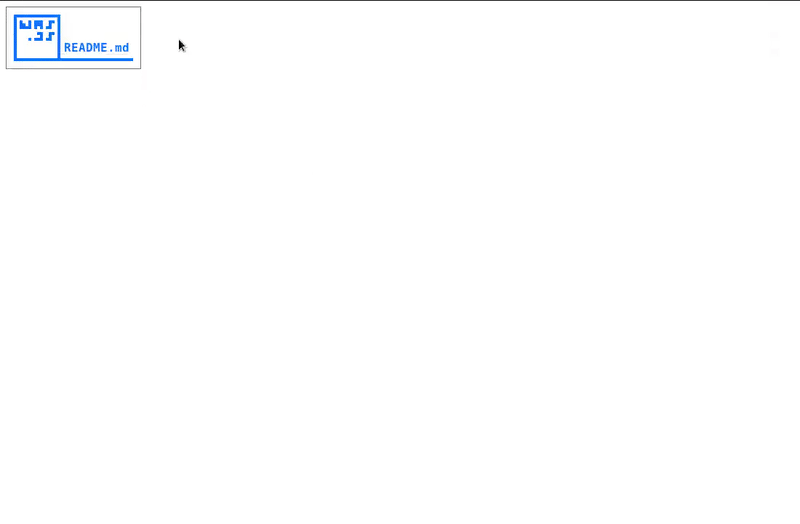

# wasjs
Wait a Second JS: Proof-of-work based timeout for web downloads

# Setup

modify the path variable inside of the `was.php` file to the directory of your files you want to host

This path does not have to be inside of your docroot, though it is recommended